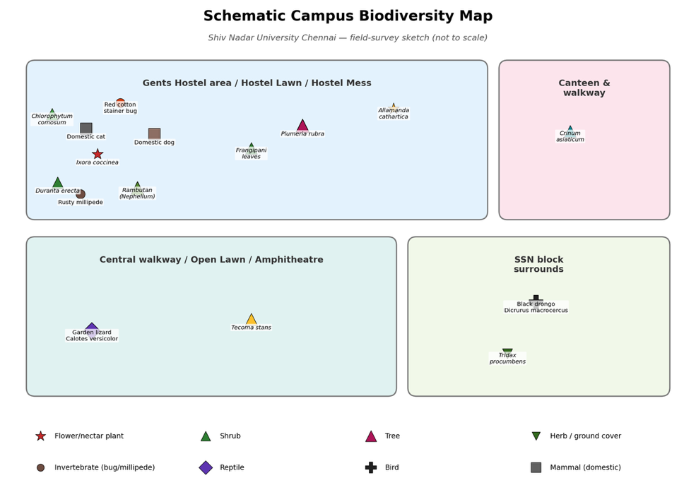

# Campus Biodiversity Inventory — Team IoT-A

## Project Details

- **Course:** Environmental Studies (EVS) — Assignment 3
- **Institution:** Shiv Nadar University Chennai
- **Team:** IoT-A
- **Objective:** To survey, photograph and systematically document the flora and fauna found across the Shiv Nadar University Chennai campus, and compile the observations into a collective class biodiversity inventory.

## Team Members

| Name              | Registration Number |
|-------------------|---------------------|
| AFEEF             | 25011102008         |
| GURUPRASAD B      | 25011102036         |
| KRISH K           | 25011102049         |
| AHMED ZAYD        | 25011102050         |
| MAITREYAN J       | 25011102053         |

## Study Area

The survey was conducted across five zones of the Shiv Nadar University Chennai campus:

1. **Near GH (Guest House)** — landscaped garden beds and roadside shrubs
2. **Mess** — greenery surrounding the dining block
3. **Canteen** — ornamental plants and open seating areas
4. **SSN** — tree-lined walkways and campus verges
5. **Amphitheatre** — open lawn and stepped seating surrounded by plantings

These zones were chosen because they are frequently used by students and host a mix of ornamental plantings, natural vegetation and associated animal life, giving a representative picture of campus biodiversity.

## Campus Survey Map

The map below shows the five survey zones covered by the team:

## Species Documented

**FLORA** (13 photographs, 9 species):

| Common Name             | Scientific Name          |
|-------------------------|--------------------------|
| Jungle Geranium         | *Ixora coccinea*         |
| Golden Dewdrop          | *Duranta erecta*         |
| Yellow Trumpet Flower   | *Allamanda cathartica*   |
| Yellow Bells            | *Tecoma stans*           |
| Frangipani              | *Plumeria rubra*         |
| Giant Crinum Lily       | *Crinum asiaticum*       |
| Coatbuttons             | *Tridax procumbens*      |
| Rambutan                | *Nephelium lappaceum*    |
| Spider Plant            | *Chlorophytum comosum*   |

**FAUNA** (6 photographs, 6 species):

| Common Name               | Scientific Name            |
|---------------------------|----------------------------|
| Rusty Millipede           | *Trigoniulus corallinus*   |
| Garden Lizard             | *Calotes versicolor*       |
| Black Drongo              | *Dicrurus macrocercus*     |
| Red Cotton Stainer Bug    | *Dysdercus cingulatus*     |
| Domestic Dog              | *Canis lupus familiaris*   |
| Domestic Cat              | *Felis catus*              |

## Conclusion

Our survey documented **15 species (9 flora, 6 fauna)** across five campus zones. The campus supports a rich mix of ornamental flowering plants — such as the Jungle Geranium, Frangipani and Yellow Bells — alongside common fauna including the Garden Lizard, Black Drongo and various insects. The presence of both cultivated and naturally occurring species shows that the campus landscape provides diverse habitats, from landscaped gardens to open lawns. This exercise highlighted the value of systematic observation in understanding local biodiversity and the importance of preserving green spaces within an educational campus.
